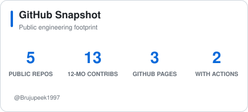
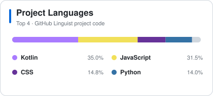
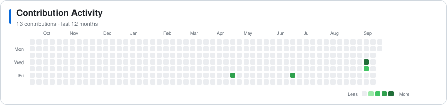

<h1>Rareș Brujan</h1>

<picture>
  <source media="(prefers-color-scheme: dark)" srcset="https://readme-typing-svg.demolab.com?font=JetBrains+Mono&amp;weight=500&amp;size=20&amp;duration=3000&amp;pause=900&amp;color=58A6FF&amp;center=true&amp;vCenter=true&amp;repeat=true&amp;width=620&amp;height=45&amp;lines=Software+Engineer;Computer+Vision+Engineer;Deep+Learning;Visual+Computing;AI+Engineering">
  <source media="(prefers-color-scheme: light)" srcset="https://readme-typing-svg.demolab.com?font=JetBrains+Mono&amp;weight=500&amp;size=20&amp;duration=3000&amp;pause=900&amp;color=0969DA&amp;center=true&amp;vCenter=true&amp;repeat=true&amp;width=620&amp;height=45&amp;lines=Software+Engineer;Computer+Vision+Engineer;Deep+Learning;Visual+Computing;AI+Engineering">
  
</picture>

  <strong>Software engineer and MSc Computer Science student at TU Graz</strong> 
  specializing in Visual Computing, Computer Vision, and Deep Learning.

  
  
  
  
  
  

<!--
Contact button placeholders — replace the values once verified:
LINKEDIN_URL · PORTFOLIO_URL
-->

---

## Current Focus

🎓 BSc Software Engineering &amp; Management · MSc Computer Science, Visual Computing @ TU Graz 
🔬 Computer Vision · Deep Learning · Object Detection · Image Segmentation 
🌲 TU Graz × AutoForst industry research · Multi-view timber imagery 
⚙️ Reproducible systems from data preparation and testing to GPU inference 
🗣️ Romanian (native) · German (C1) · English (C1)

---

## Currently Working On

> ### From Bark to Byte
>
> TU GRAZ × AUTOFORST · INDUSTRY RESEARCH COLLABORATION · 2026–PRESENT
>
> **A configurable computer-vision pipeline for real multi-view timber scanner imagery and metadata.**
>
> Combines validated preprocessing, automated tests, manual review stages, pretrained TimberVision YOLO segmentation, OpenCV, and GPU-accelerated inference. Its outputs support training-ready CNN and Vision Transformer classification experiments.
>
> `Python` · `Multi-view imagery` · `YOLO` · `OpenCV` · `CNNs` · `Vision Transformers`
>
>  

---

## Technology Stack

  <strong>LANGUAGES</strong>  
  <picture>
    <source media="(prefers-color-scheme: dark)" srcset="https://skillicons.dev/icons?i=py%2Cc%2Ccpp%2Ccs%2Cts%2Cjs%2Ckotlin&amp;theme=dark">
    <source media="(prefers-color-scheme: light)" srcset="https://skillicons.dev/icons?i=py%2Cc%2Ccpp%2Ccs%2Cts%2Cjs%2Ckotlin&amp;theme=light">
    
  </picture>

  <strong>AI &amp; COMPUTER VISION</strong>  
  <picture>
    <source media="(prefers-color-scheme: dark)" srcset="https://skillicons.dev/icons?i=pytorch%2Copencv&amp;theme=dark">
    <source media="(prefers-color-scheme: light)" srcset="https://skillicons.dev/icons?i=pytorch%2Copencv&amp;theme=light">
    
  </picture> 
  YOLO · Object Detection · Image Segmentation · Synthetic Data

  <strong>BACKEND &amp; DATA</strong>  
  <picture>
    <source media="(prefers-color-scheme: dark)" srcset="https://skillicons.dev/icons?i=flask%2Cpostgres%2Csupabase%2Cfirebase&amp;theme=dark">
    <source media="(prefers-color-scheme: light)" srcset="https://skillicons.dev/icons?i=flask%2Cpostgres%2Csupabase%2Cfirebase&amp;theme=light">
    
  </picture> 
  SQL · Firestore

  <strong>APPLICATIONS &amp; ENGINEERING</strong>  
  <picture>
    <source media="(prefers-color-scheme: dark)" srcset="https://skillicons.dev/icons?i=unity%2Creact%2Cgit%2Cgithubactions%2Clinux&amp;theme=dark">
    <source media="(prefers-color-scheme: light)" srcset="https://skillicons.dev/icons?i=unity%2Creact%2Cgit%2Cgithubactions%2Clinux&amp;theme=light">
    
  </picture> 
  Jetpack Compose · Vite · Vitest · REST APIs · CI/CD · Automated Testing

---

## Featured Engineering

> ### GuidanceAR · Bachelor's Thesis
>
> **Mobile AR and computer-vision system connecting a Unity/C# client to a Python/Flask inference service.** It includes OpenCV/YOLO detection tooling and a Unity Perception pipeline that generated 20,000+ synthetic training images with segmentation masks and polygon annotations.
>
> `Unity` · `C#` · `Python` · `Flask` · `OpenCV` · `YOLO`
>
>  

> ### BrickWorth Pricing Pipeline
>
> **Nightly, dependency-free Python data pipeline.** Collects BrickLink listings, normalizes prices with ECB exchange rates, separates item conditions, and publishes confidence-aware JSON snapshots only when the output changes.
>
> `Python 3.11` · `Data Integration` · `JSON / XML` · `GitHub Actions`
>
>  

---

## GitHub Snapshot

  <picture>
    <source media="(prefers-color-scheme: dark)" srcset="assets/stats-dark.svg">
    <source media="(prefers-color-scheme: light)" srcset="assets/stats-light.svg">
    
  </picture>
  <picture>
    <source media="(prefers-color-scheme: dark)" srcset="assets/languages-dark.svg">
    <source media="(prefers-color-scheme: light)" srcset="assets/languages-light.svg">
    
  </picture>

Top-language distribution reflects GitHub Linguist code size across public project repositories—not proficiency.

<picture>
  <source media="(max-width: 600px) and (prefers-color-scheme: dark)" srcset="assets/activity-mobile-dark.svg">
  <source media="(max-width: 600px) and (prefers-color-scheme: light)" srcset="assets/activity-mobile-light.svg">
  <source media="(prefers-color-scheme: dark)" srcset="assets/activity-dark.svg">
  <source media="(prefers-color-scheme: light)" srcset="assets/activity-light.svg">
  
</picture>

---

<strong>Open to software engineering, computer vision, and AI opportunities.</strong>

